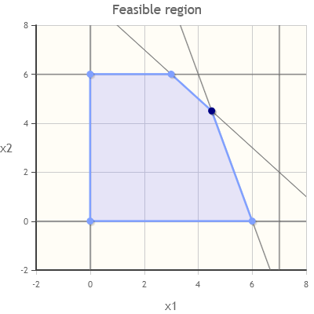
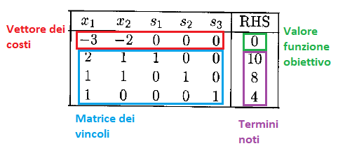
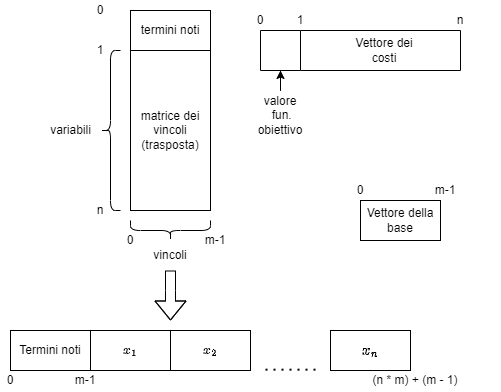

```{r setup, include=FALSE}
knitr::opts_chunk$set(echo = TRUE)
```

# Introduzione al metodo del simplesso
## Problemi di ottimizzazione lineare
Nell'ambito della Ricerca Operativa (Operations Research) uno dei principali argomenti è la cosiddetta
**ottimizzazione lineare**, ossia lo studio di una classe di problemi del tipo:

\begin{gather*}
  \min/\max c^T x \\
  \text{subject to} \\
  Ax \lesseqgtr b
\end{gather*}


con $x \in \mathbb{R}^n$, $c \in \mathbb{R}^n$, $A \in \mathbb{R}^{m \times n}$, $b \in \mathbb{R}^{1\times m}$.

In altre parole, si vogliono trovare dei valori per le componenti del vettore $x$ (di dimensione $n$) tali da massimizzare (o minimizzare) il valore di una *funzione lineare* variabili (detta **funzione obiettivo**, mentre il vettore $c$ è chiamato **vettore dei costi**), dati una serie di $m$ vincoli espressi nel sistema di disequazioni lineari $Ax \lesseqgtr b$ (dove $A$ è detta **matrice dei vincoli** e $b$ **vettore dei termini noti**).

Questa classe di problemi permette di modellare un gran numero di situazioni reali in molteplici ambiti (ottimizzazione dei costi, creazione di orari, *etc.*), oltre che alcuni problemi NP-hard come il *Knapsack* o il *Vertex Cover*.

Dal punto di vista dell'algebra lineare, un problema in $n$ varibili non è altro che uno spazio $\mathbb{R}^n$, la funzione obiettivo è una retta nello spazio, mentre i vincoli definiscono un *poliedro* nello spazio.

Utilizzando i teoremi e le tecniche dell'algebra lineare è stato possibile creare degli algoritmi per risolvere i problemi di ottimizzazione, come il
**simplesso**, i quali si prestano molto bene ad essere parallelizzati (in quanto operano su matrici).

### Problemi risolvibili, non risolvibili, illimitati
Dato un problema di ottimizzazione, questo può essere di tre tipi:

- ammissibile (*feasible*): ossia esistono uno o più vettori che moltiplicati per il vettore dei costi assegnano alla funzione obiettivo il valore massimo (o minimo possibile) e tutti i vincoli sono rispettati,

- non ammissibile (*infeasible*): se non esistono soluzioni

- illimitati (*unbounded*): se per una o più componenti della soluzione è possibile aumentarne (o ridurne) il valore all'infinito senza mai violare i vincoli

- degeneri (*degenerate*): sono problemi ammissibili in cui più soluzioni di base corrispondono allo stesso vertice del poliedro. In linea teorica possono far ciclare l'algoritmo (ossia l'algoritmo torna a controllare basi già viste in precedenza), ma all'atto pratico questo può essere evitato introducendo delle euristiche. Per semplicità la nostra implementazione una volta riconosciuto un problema come degenere lo segnala all'utente e termina senza cercare di risolverlo.

## Forma canonica e forma standard
I problemi di massimizzazione possono essere convertiti in problemi di minimizzazione (e viceversa), così come è possibile manipolare le singole disequazioni.
Queste operazioni servono a riportare i problemi in una forma che permetta di utilizzarli da parte dei solver. In particolare vengono utilizzate la forma *canonica* e la forma *standard*.

Un problema (di massimizzazione) è in forma canonica se è nella forma

\begin{gather*}
  \max c^T x \\
  \text{subject to} \\
  Ax \leq b \\
  x \geq 0 
\end{gather*}

Considerando che qualsiasi disequazione nella forma $\alpha x \leq y$ può essere convertita in una equazione equivalente $\alpha x + \delta = b$ definiamo la forma standard di un problema in forma canonica

\begin{gather*}
  \max (c | 0)^T x \\
  \text{subject to} \\
  (A | I)x = b \\
  x \geq 0
\end{gather*}

con $(A | I) \in \mathbb{R}^{m \times (n + m)}$, $(c | 0) \in \mathbb{R}^{n + m}$ e $I$ la matrice di identità di dimensione $m$.

In altre parole aggiungiamo una nuova variabile al problema (detta variabile *slack*) per ogni disequazione.

La forma standard è quella che viene utilizzata dagli algoritmi di soluzione.

## Metodo del simplesso a due fasi
Il metodo del simplesso è un'algoritmo per risolvere i problemi di ottimizzazione lineari.

Si basa sul teorema secondo il quale le soluzioni (dette *soluzioni di base*) di un qualsiasi problema in forma standard sono i *vertici* del poliedro costruito sui vincoli.

Ogni vertice è individuato da una o più *soluzioni di base ammissibili*, cioè tutti i valori delle variabili in base sono maggiori o uguali a 0, mentre il valore delle altre variabili è 0.
Se in base sono presenti uno o più valori uguali a 0, si dice che la base è *degenere*.

Esistono diverse implementazioni del metodo del simplesso, per questo progetto verrà implementato il cosiddetto *simplesso a due fasi con il metodo del tableau*



### Cos'è il tableau
Il tableau di un simplesso è la struttura dati su cui viene eseguito l'algoritmo del simplesso.

Si tratta di una matrice composta nel seguente modo:



Nella prima riga della matrice ($R_0$) è presente il vettore dei costi.
Inizialmente il vettore dei costi contiene i coefficienti della funzione obiettivo con segno invertito.
La base viene memorizzata in un vettore a parte.

### Algoritmo di soluzione
\begin{algorithm}
\caption{Simplex}
\label{alg:simplex}
\KwData{$T \in \mathbb{R}^{(m+1)\times (n+1)}, \mathcal{B}\in \mathbb{N}^m$}
\KwOut{$x$ come soluzione, $\mathcal{B}$ base della soluzione e $T[0][n]$ valore ottimo della funzione obiettivo OPPURE problema UNBOUNDED}

$A \gets T[1..m][0..n-1]$ \tcc*[r]{La notazione $[a..b]$ indica una porzione di array dall'indice $a$ all'indice $b$}
$b \gets T[1..m][n]$\;
$c \gets T[0][0..n-1]$\;
\While{$\exists i : c[i] < 0$}{
  Pick $h \in \{0,\dots,n-1\} : c[h] = \min_{i=0,\dots,n-1} c[i]$\;
  \If{$\forall i \in \{0,\dots,m-1\} \Rightarrow A[0..m-1][h] \leq 0$}{
    \Return{problem UNBOUNDED}\;
  }
  Pick $k \in \{0,\dots,m-1\} : c[k] = \min_{i=0,\dots,m-1} \left\{ \frac{b[i]}{A[i][h]} \land A[i][h] > 0 \right\}$\;
  $p \gets A[k][h]$\;
  $\mathcal{B}[k] \gets h$\;
  $R_p \gets copy(T[k][0..n])$\;
  $C_p \gets copy(T[0..m][h+1])$\;
  \For{$i\gets 0\ \text{to}\ m$}{
    \For{$j\gets 0\ \text{to}\ n$}{
      \If{$i = k$}{
        $T[i][j] = \frac{1}{p}T[i][j]$\;
      }
      \Else{
        $T[i][j] = T[i][j] - \frac{C_p[i]}{p}R_p[j]$\;
      }
    }
  }
}

$x[0..n-1] \gets 0$\;
\For{$i\gets 0\ \text{to}\ m-1$}{
  $x[\mathcal{B}[i]] \gets b[i]$\;
}
\Return{$(x, \mathcal{B}, T[0][n])$} \tcc*[r]{$T[0][n]$ è il valore della funzione obiettivo}
\end{algorithm}

#### Complessità \label{par:complessita}
Considerando che l'algoritmo non fa altro che esplorare le soluzioni di base ammissibili, l'algoritmo esplora al massimo $O\binom{n + m}{m}$ (con $n$ numero di variabili e $m$ il numero di vincoli).

Nei casi peggiori il simplesso può raggiungere complessità esponenziali. Tuttavia nel corso degli anni si è visto EMPIRICAMENTE come questa complessità venga raggiunta in pochissimi casi specifici, anzi l'algoritmo si è rivelato molto efficiente su problemi "reali", dove in media raggiunge una complessità nell'ordine di $O(mn)$, anche a confronto con altri algoritmi di soluzione (polinomiali per costruzione) come il metodo dei punti interni.

Da queste considerazioni si può concludere anche come la complessità del simplesso dipenda molto dall'istanza del problema fornito in input.

### Fase 1
In questa fase si costruisce il tableau e si verifica se il problema di partenza è ammissibile o meno.
Per fare ciò si risolve il cosiddetto **problema ausiliario**
\begin{gather*}
  \max (0|-1)^T x \\
  \text{subject to} \\
  (A | I | I)x = b \\
  x \geq 0
\end{gather*}
In pratica aggiungo al problema originario $m$ nuove variabili (dette **variabili artificiali**) e cerco di azzerarne la somma negata. Se ciò avviene il problema di partenza è ammissibile e la soluzione di base ottenuta può essere utilizzata come base di partenza per la fase 2 dell'algoritmo, altrimenti il problema originale non è ammissibile.
Se nella base finale una delle variabili artificiali è rimasta in base il problema è degenere.
Per lo pseudocodice si veda l'algoritmo \ref{alg:simplex-phase1}.

\begin{algorithm}
\caption{Simplex-Phase1}
\label{alg:simplex-phase1}
\KwData{$A \in \mathbb{R}^{m\times n}, b \in \mathbb{R}^m$ in forma standard (senza var. slack)}
\KwOut{$T \in \mathbb{R}^{(n+m+1)\times (m+1)}$ tableau per la fase 2 e $\mathcal{B}\in \mathbb{N}^m$ base ammissibile OPPURE problema INFEASIBLE o DEGENERE}

\tcc{riempimento tableau}
$T \in \mathbb{R}^{(m+1)\times (n + 2m + 1)}$\;
$T[0][0..n+m-1] \gets 0$\;
$T[0][n+m..n+2m-1] \gets 1$\;
$T[0][n+2m] \gets 0$\;
$T[1..m][n+2m] \gets b$\;
$T[1..m][0..n-1] \gets A$\;
$T[1..m][n..n+m-1] \gets I$ \tcc*[r]{variabili slack}
$T[1..m][n+m..n+2m-1] \gets I$ \tcc*[r]{variabili artificiali}

\tcc{Nego eventuali disequazioni con termine noto negativo (in modo da rendere la base iniziale ammissibile)}
\For{$i\gets 1\ \text{to}\ m$}{
  \If{$T[i][n+2m] < 0$}{
    \For{$j\gets 0\ \text{to}\ n+2m$}{
      $T[i][j] = -T[i][j]$\; 
    }
  }
}

$\mathcal{B} \gets [n+m,\dots,n+2m-1]$ \tcc*[r]{base iniziale con le variabili artificiali}
\tcc{esprimo la funzione obiettivo solo in funzione delle variabili non di base}
\For{$i\gets 1\ \text{to}\ m$}{
    \For{$j\gets 0\ \text{to}\ n+2m$}{
      $T[0][j] \gets T[0][j] - T[0][\mathcal{B}[i]] * T[i][j]$
    }
}

$(x, \mathcal{B}, f) \gets Simplex(T, \mathcal{B})$\;
\If{$f < 0$}{
  \Return{problem INFEASIBLE}\;
}
\If{$\exists i : n+m \leq\mathcal{B}[i]< n+2m $}{
  \Return{problem DEGENERE}\;
}

\tcc{Elimino le variabili artificiali}
$T[0..m][n+m] \gets copy(T[0..m][n+2m])$\;
$drop(T[0..m][n+m+1..n+2m])$\;

\Return{$(T, \mathcal{B})$}
\end{algorithm}

### Fase 2
Terminata la prima fase si eliminano le variabili artificiali dal tableau e si sostituisce la funzione obiettivo con quella del problema originale, in seguito si procede a risolvere il problema originale. Per lo pseudocodice si veda l'algoritmo \ref{alg:simplex-phase2}.

\begin{algorithm}
\caption{Simplex-Phase2}
\label{alg:simplex-phase2}
\KwData{$T \in \mathbb{R}^{(m+1)\times (n+m+1)}, \mathcal{B} \in \mathbb{N}^m, c \in \mathbb{R}^n$}
\KwOut{soluzione al problema iniziale OPPURE problema UNBOUNDED}

$T[0][0..n-1] \gets -c$\;
$T[0][n..n+m] \gets 0$\;

\tcc{esprimo la funzione obiettivo solo in funzione delle variabili non di base}
\For{$i\gets 1\ \text{to}\ m$}{
    \For{$j\gets 0\ \text{to}\ n+m$}{
      $T[0][j] \gets T[0][j] - T[0][\mathcal{B}[i]]*T[i][j]$
    }
}

\Return{$Simplex(T, \mathcal{B})$}
\end{algorithm}

### Simplesso a due fasi
Si veda l'algoritmo \ref{alg:2phases-simplex}.
\begin{algorithm}
\caption{2Phases-Simplex}
\label{alg:2phases-simplex}
\KwData{$A \in \mathbb{R}^{m \times n}, b \in \mathbb{R}^m, c \in \mathbb{R}^n$}
\KwOut{soluzione al problema OPPURE problema INFEASIBLE o UNBOUNDED o DEGENERE}

$(T,\mathcal{B}) \gets Simplex-Phase1(A, b)$\;
\Return{$Simplex-Phase2(T, \mathcal{B}, c)$}

\end{algorithm}

# Scelte implementative

## Gestione della memoria
- I dati del problema originale sono memorizzati in memoria host, mentre il tableau viene costruito e memorizzato nella memoria globale della scheda video.

- I dati del problema originale vengono memorizzati utilizzando memoria *page-locked*, questo per permettere i trasferimenti di memoria in parallelo con i CUDA Stream (e quindi ottimizzare la fase di costruzione del tableau in global memory).

- Il vettore della base è memorizzato come memoria *mapped page-locked*, in modo da potervi accedere sia lato host che lato GPU in qualsiasi momento senza dover gestire i trasferimenti.

- Siccome l'algoritmo opera spesso su singole righe o colonne è fondamentale memorizzare i dati in memoria globale in modo da minimizzare il numero di accessi strided o disallineati. Per questo motivi si è deciso il seguente schema di memorizzazione (visibile in figura \ref{fig:memory}):
    
    - la matrice del tableau è memorizzata linearizzata per **colonne**. In altre parole l'implementazione utilizza il tableau trasposto, ossia le colonne del tableau sono i vincoli del problema, mentre le righe sono le variabili. L'algoritmo, infatti, tende di più ad accedere ai vettori delle singole variabili che a quelli dei singoli vincoli.
    Per copiare singole colonne della matrice in vettori in global memory si è visto che l'approccio migliore (dal punto di vista del tempo necessario ad eseguire l'operazione) è quello di utilizzare comunque gli accessi strided, invece di altri pattern di accesso più efficienti dal punto di vista della bandwith utilizzata (Es. copiare un tile della matrice in shared memory e poi copiare la colonna desiderata dalla shared memory in global memory);
    
    - il vettore dei termini noti non viene memorizzato in fondo al tableau, ma nella prima riga della matrice. In questo modo nel passaggio dalla fase 1 alla fase 2 non è necessario spostare la colonna nella matrice, ma è sufficiente troncare il numero di righe senza dover intervenire sull'allocazione della memoria;

    - il vettore dei costi non viene memorizzato nella matrice del tableau, ma in un vettore a parte e il valore della funzione obiettivo è nel primo elemento di questo vettore (analogalmente a quanto fatto con il vettore dei termini noti al punto precedente).

```{r memory, echo=FALSE, fig.cap="Schema di memorizzazione in memoria globale", out.width="50%", fig.align="center"}

```

## Schema di parallelizzazione
Per introdurre parallelismo si è deciso di parallelizzare le singole operazioni svolte sui vettori e sulle matrici, mantenendo intatta la struttura dell'algoritmo.

Così facendo non si prevede una riduzione della complessità teorica dell'algoritmo, ma ottenere un miglioramento empirico sul tempo necessario a risolvere un'istanza rispetto a un'algoritmo puramente seriale.

### Creazione tableau (Algoritmo \ref{alg:simplex-phase1}, righe 1-16)
Il tableau viene creato a partire dai dati del problema (matrice dei vincoli già linearizzata per colonne, vettore dei termini noti e dei coefficienti della funzione obiettivo).
Per prima cosa si istanziano in global memory:
  
- il vettore che memorizza la matrice dei vincoli e il vettore dei termini noti con *cudaMallocPitch* di dimensione $m\times (n+2m+1)$. La larghezza reale della matrice (in byte) in memoria viene salvata nel campo *pitch* di *tabular_t*. Per comodità si salvano in due campi distinti di *tabular_t* i puntatori al vettore dei termini noti (lo stesso della matrice) e quello alla matrice dei vincoli (la seconda riga della matrice);
    
- il vettore dei costi di dimensione $n+2m+1$ con *cudaMalloc*

- il vettore della base di dimensione $m$ utilizzando *cudaHostAlloc* con il flag *cudaHostAllocMapped*

Successivamente si procede a riempire questi vettori. Per fare ciò si utilizzano sei cudaStream differenti:

1. il primo stream imposta a 0 i primi $n+m+1$ valori del vettore dei costi a 0 con *cudaMemset*,

2. il secondo stream imposta a 1 i restanti $m$ valori della funzione dei costi (utilizzando un kernel apposito),

3. il terzo stream copia la matrice dei vincoli dalla memoria host alla matrice in global memory con *cudaMemcpy2D*,

4. il quarto stream costruisce in coda alla matrice dei vincoli le due matrici di identità, una per le variabili slack e una per le variabili artificiali, utilizzando un kernel apposito,

5. il quinto stream copia il vettore degli indicatori dalla memoria host alla global memory con *cudaMemcpy*,

6. il sesto stream inizializza il vettore della base con numeri progressivi da $n+m$ a $n+2m-1$ con un kernel apposito.

Una volta terminata questa prima fase si procede a scandire il vettore dei termini noti per verificare che tutti i valori siano maggiori o uguali a 0 (in modo che la base iniziale sia ammissibile). Se un elemento è negativo viene lanciato un nuovo kernel (tramite parallelismo dinamico) che inverte i segni a tutti gli elementi della colonna corrispondente. Questo equivale a moltiplicare l'equazione della colonna per -1.

### Aggiornamento funzione obiettivo (Algoritmo \ref{alg:simplex-phase1}, righe 17-21 e Algoritmo \ref{alg:simplex-phase2}, righe 3-7)
Lo scopo di questa operazione è quello di azzerare tutti gli elementi del vettore dei costi in corrispondenza delle variabili in base (una variabile è in base se nel suo vettore è presente un solo elemento a 1 e il resto è a 0).

Per fare ciò si effettuano una serie di eliminazioni di Gauss sottraendo al vettore dei costi tutte le righe della matrice opportunatamente moltiplicate per il valore della $i$-esima variabile di base nel vettore dei costi.

Per fare questa operazione sono stati provati due approcci:

- un approccio "naive" che sfrutta le aomicAdd native e che funziona banalmente lasciando ad ogni thread del tile il caricamento, moltiplicazione ed aggiornamento nella funzione obiettivo

- un approccio più ragionato che sfrutta la riduzione, dove l'aggiornamento della funzione obiettivo viene fatta solo da un sottoinsieme di kernel sfruttando a tal fine la riduzione intra warp

Il motivo per sono state pensate due soluzioni è dovuto al fatto che le somme atomiche per i double sono disponibili solo a partire dalla compute capability 6.0, il che richiede di implementare manualmente le somme atomiche attraverso l'operazione atomica CAS se si vuole garantire il funzionamento del kernel anche per schede video con C.C. inferiore alla 6.0.

Nella seguente tabella sono riportati i tempi ottenuti per i due kernel (con configurazione di lancio ottimale ed ottimizzazioni implementate).


| Naive (cc < 6.0) | Riduzione (cc < 6.0) | Naive (cc > 6.0) | Riduzione (cc > 6.0) |
|:----------------:|:--------------------:|:----------------:|:--------------------:|
|     209.23ms     |       52.142ms       |     38.720ms     |       50.610ms       |

Table: Risultati sperimentali dei diversi kernel, con la configurazione di lancio ottimale (blocco: 32*32, grid: (1, roof(24.588/32))) ed ottenuti con una scheda mx250.

IL risultato peggiore ottenuto risulta essere quello con l'approccio naive e con cc < 6.0, che impiega circa quattro volte tanto gli altri casi. Per tale motivo in tale situazione conviene utilizzare l'approccio con riduzione.

Nel caso di cc >= 6.0 la situazione è diversa e quello più efficiente risulta essere quello che sfrutta l'approccio naive, grazie all'ottimizzazione dell'atomicAdd

A partire da queste considerazioni si è deciso di sfruttare l'approccio naive mantenendo quello ragionato solamente nel caso il programma venga compilato per essere utilizzato su schede video con cc < 6.0

In ogni caso nella pratica il tempo necessario per svolgere l'eliminazione di gauss è trascurabile, anche nel caso peggiore (naive, cc<6.0 e privo di ottimizzazioni che impiega un tempo dell'ordine delle decine di secondi con gpu mx250), come si vedrà durante la discussione dei risultati sperimentali.

### Verifica di degenerazione (Algoritmo \ref{alg:simplex-phase1}, riga 26)
Per verificare se il problema è degenere si scandisce il vettore della base e si verifica se l'elemento in questione sia compreso tra $n+m$ e $n+2m$ (non compreso). Se sì, si incrementa di 1 (con *atomicAdd*) un contatore in global memory e una volta terminata la scansione si controlla se il valore di questo contatore sia maggiore di 0.

### Sostituzione vettore dei costi (Algoritmo \ref{alg:simplex-phase2}, righe 1-2)


### Ricerca dell'elemento minimo nel vettore dei costi e in quello degli indicatori (Algoritmo \ref{alg:simplex}, righe 4-5 e 9)

### Verifica di unbounding (Algoritmo \ref{alg:simplex}, riga 6)

### Aggiornamento tableau (Algoritmo \ref{alg:simplex}, righe 12-24)
#### Considerazioni sulle operazioni in virgola mobile

### Estrazione della soluzione (Algoritmo \ref{alg:simplex}, righe 25-29)

# Risultati sperimentali
Al fine di analizzare le prestazioni del solver è stato predisposta una funzione di benchmark con dati generati da un generatore casuale di istanze.

Il benchmark consiste nella risoluzione di una serie di problemi con dimensione crescente a partire da 256 variabili per 256 vincoli a 8192 variabili per 8192 vincoli. Il passo tra un benchmark e l'altro è esponenziale sulle potenze di due.

Per i benchmark il generatore utilizza come seed la dimensione del problema, per cui si andranno
a generare ogni volta gli stessi problemi. In questo modo è possibile rieseguire il benchmark
su dispositivi diversi e poter confrontare le prestazioni.

## Misurazione dei tempi
Per misurare i tempi sono stati utilizzati gli eventi di CUDA così come visto a lezione e sulla guida ufficiale di NVIDIA.
Nonostante il metodo *cudaEventElapsedTime* misuri i tempi in ms, per evitare numeri eccessivamente piccoli (soprattutto sulle istanze più piccole) i tempi dei benchmark sono espressi in $\mu$s (ottenuti moltiplicando il valore della misurazione per $1000$).

Come già discusso nel paragrafo \ref{par:complessita} sulla complessità del simplesso, non ha molto senso misurare il tempo globale dell'algoritmo, per cui si è deciso di misurare i tempi delle singole operazioni che lo compongono, in particolare il tempo necessario a svolgere una singola iterazione del ciclo ricerca del pivot-aggiornamento del tableau (algoritmo \ref{alg:simplex} da riga 4 a riga 24), che d'ora in poi chiameremo **ciclo di solve** per semplicità.

Tutte le misurazioni vengono salvate su file csv per essere analizzate utilizzando il software R.

### Occupazione ciclo di solve
Come accennato durante la spiegazione degli approcci utilizzati per la parallelizzazione dell'algoritmo il collo di bottiglia dell'algoritmo risulta essere il **ciclo di solve** come mostrato dal seguente grafico.


```{r, echo=FALSE, warning=FALSE}
##costruzione dataframes
mantenere <- c("operation","elapsed_time")
sequence <- c(256, 512, 1024, 2048, 4096, 8192)
mx250.solvePercentage <- c(); ##aggiungere qui per altre schede

for(var in sequence){
  ####mx 250####
    temp <- format(var)
    fileLocation <- "./../data/measures/mx250_2/"    #sostituire con locazione desiderata
    filename <- paste(fileLocation, "benchmark_", temp, "_", temp, ".txt", sep = "")
    
    #lettura file
    currentData <- read.csv(filename)
    
    #elaborazione file
    currentData <- subset(currentData, select = mantenere)
    currentData["operation"][currentData["operation"] == "gauss1" | currentData["operation"] == "gauss2"] <- "gauss"
    currentData <- aggregate(currentData$elapsed_time, by=list(Category=currentData$operation),FUN=sum)
    
    #calcolo percentuale
    totalTime <- sum(currentData$x)
    currentData$percentage <- (currentData$x / totalTime) * 100
    
    row <-  subset(currentData, Category == "solve")
    
    #salvataggio valore
    mx250.solvePercentage <- c(mx250.solvePercentage,  row$percentage)
}

edge <- sequence;
m250.percentage <- data.frame(edge, mx250.solvePercentage);

plot(data = m250.percentage, mx250.solvePercentage~edge, main = "Percentuale di tempo occupata dal ciclo di solve", type = 'b', xlab = "Dimensione lato matrice", ylab = "Percentuale tempo in solve")
```
Come possibile notare dal grafico, per l'esecuzione delle istanze di benchmarking si ha un tempo speso nella esecuzione del ciclo di solving superiore al 99% del tempo totale già per matrici di dimensione 256x256, per cui ad una riduzione della durata di una singola iterazione di tale ciclo corrisponde una riduzione nel tempo di esecuzione e rispettiva risoluzione del problema di partenza.

### Analisi in funzione della dimensione del problema
Dato che il tempo richiesto dall'algorirmo dipende quasi esclusivamente dal tempo totale del ***ciclo di solve*** il centro dell'attenzione in questa analisi viene posto proprio sul tempo medio richiesto per un singolo singolo ciclo.

La durata del ciclo dipenderà chiaramente dalla dimensione del problema, che a sua volta dipende da: il numero di variabili ed il numero di vincoli.

Il tempo medio richiesto da un singolo ciclo di solve non cresce nello stesso modo all'aumentare delle due dimensioni, come possibile notare dai seguenti grafici tridimensionali:

```{r, echo=FALSE, warning=FALSE}
library(plot3D)

#preparazione dataframes
vars <- c()
constraints <- c()
solvePhaseOne.mean <- c()
solvePhaseOne.total <- c()
solvePhaseTwo.mean <- c()
solvePhaseTwo.total <- c()

values <- c(256, 512, 1024, 2048, 4096, 8192)
for(var in values){               ##usiamo un for per caricarli tutti
  
  for(constraint in values){
    
    vars <- c(vars, var)
    constraints <- c(constraints, constraint)
    
    ##composizione nome file
    temp1 <- format(var)
    temp2 <- format(constraint)
    fileLocation <- "./../data/measures/mx250_2/"    #sostituire con locazione desiderata
    filename <- paste(fileLocation, "benchmark_", temp1, "_", temp2, ".txt", sep = "")
    
    ##lettura file
    currentData <- read.csv(filename)
    
    ##isoliamo il tempo di solve per le diverse fasi
     #fase 1
    variables <- (var + 2*constraint) + 1
    tempData <- subset(currentData, vars == format(variables) & operation == "solve" )
    solvePhaseOne.mean <- c(solvePhaseOne.mean, mean(tempData$elapsed_time))
    solvePhaseOne.total <- c(solvePhaseOne.total, sum(tempData$elapsed_time))
    
     #fase 2
    variables <- (var + constraint) + 1
    tempData <- subset(currentData, vars == format(variables) & operation == "solve" )
    solvePhaseTwo.mean <- c(solvePhaseTwo.mean, mean(tempData$elapsed_time))
    solvePhaseTwo.total <- c(solvePhaseTwo.total, sum(tempData$elapsed_time))
     }
}

names <- c("vars", "constraints", "values")

phaseOneFrame.mean<- data.frame(vars, constraints, solvePhaseOne.mean);
phaseOneFrame.total<- data.frame(vars, constraints, solvePhaseOne.total);
phaseTwoFrame.mean<- data.frame(vars, constraints, solvePhaseTwo.mean);
phaseTwoFrame.total<- data.frame(vars, constraints, solvePhaseTwo.total);

colnames(phaseOneFrame.mean) <- names; 
colnames(phaseOneFrame.total) <- names;
colnames(phaseTwoFrame.mean) <- names;
colnames(phaseTwoFrame.total) <- names;
##dataframe pronti

#fittiamo un modello, opzionale eventualmente eliminare
phaseOneFrame.mean.lm <- lm(values ~ constraints + vars + 1, data = phaseOneFrame.mean)
phaseOneFrame.total.lm <- lm(values ~ constraints + vars + 1, data = phaseOneFrame.total)
phaseTwoFrame.mean.lm <- lm(values ~ constraints + vars + 1, data = phaseTwoFrame.mean)
phaseTwoFrame.total.lm <- lm(values ~ constraints + vars + 1, data = phaseTwoFrame.total)

##grafici 3d

  ## tempo medio per il ciclo di solve
  par(mfrow=c(1,2))
  scatter3D(phaseOneFrame.mean$vars, phaseOneFrame.mean$constraints, phaseOneFrame.mean$values,
            theta = -35, phi = 5, bty = "g",  type = "h",
            pch = 19,
            zlim = c(0, max(solvePhaseOne.mean)),
            surface = TRUE, fill=TRUE, grid=TRUE, grid.lines=26,
            xlab = "variabili", ylab = "vincoli", zlab = "tempo", main = "Fase 1")
  scatter3D(phaseTwoFrame.mean$vars, phaseTwoFrame.mean$constraints, phaseTwoFrame.mean$values,
            theta = -35, phi = 5, bty = "g",  type = "h",
            pch = 19,
            zlim = c(0, max(solvePhaseOne.mean)),
            surface = TRUE, fill=TRUE, grid=TRUE, grid.lines=26,
            xlab = "variabili", ylab = "vincoli", zlab = "tempo", main = "Fase 2")
  par(mfrow=c(1,1))

```

La differenza nella variazione risulta essere più chiara se si fissa una delle due dimensioni e si analizza il tempo medio per ***ciclo di solve*** al variare dell'altra.

```{r, echo=FALSE, warning=FALSE}

  fixedValue = 4096

  phaseOneMean_FixVars <- subset(phaseOneFrame.mean, vars == fixedValue)
  phaseTwoMean_FixVars <- subset(phaseTwoFrame.mean, vars == fixedValue)
  phaseOneMean_FixConstraints <- subset(phaseOneFrame.mean, constraints == fixedValue)
  phaseTwoMean_FixConstraints <- subset(phaseTwoFrame.mean, constraints == fixedValue)
  
  par(mfrow=c(2,2))
  
  plot(data = phaseOneMean_FixVars, values~constraints, type = 'b', main = paste("Fase 1, Vars: ",fixedValue))
  plot(data = phaseTwoMean_FixVars, values~constraints, type = 'b', main = paste("Fase 2, Constraints: ",fixedValue))
  plot(data = phaseOneMean_FixConstraints, values~vars, type = 'b', main = paste("Fase 1, Vars: ",fixedValue))
  plot(data = phaseTwoMean_FixConstraints, values~vars, type = 'b', main = paste("Fase 2, Constraints: ",fixedValue))
  
  par(mfrow=c(1,1))
 
```

La spiegazione di questa caratteristica è da ricercarsi nel funzionamento pratico dell'algoritmo l'algoritmo: durante il ***ciclo di solve*** un passo fondamentale dell'algoritmo è l'aggiornamento del tableu, tale tableu non ha una dimensione pari a "N.Variabili * N.Vincoli", bensì pari a "(N.Variabili + 2 * N.Vincoli) * N.Vincoli" nel caso della fase 1, mentre "(N.Variabili + N.Vincoli) * N.Vincoli" nel caso della fase 2.

Si ha di conseguenza un incremento quadratico nel numero di aggiornamenti da fare all'aumentare dei vincoli ma solo lineare all'aumentare delle variabili.

Un ulteriore grafico interessante che mette ancora di più in evidenza questa caratteristica è quello che mette in relazione il tempo medio per ciclo di solve alla dimensione del problema, quest'ultima calcolata come "N.Variabili * N.Vincoli". 

```{r, echo=FALSE, warning=FALSE}

  phaseOneMean_ElemNumber <- phaseOneFrame.mean
  phaseTwoMean_ElemNumber <- phaseTwoFrame.mean

  
  phaseOneMean_ElemNumber$cells <- phaseOneMean_ElemNumber$constraints * phaseOneMean_ElemNumber$vars
  phaseTwoMean_ElemNumber$cells <- phaseTwoMean_ElemNumber$constraints * phaseTwoMean_ElemNumber$vars
  
  par(mfrow=c(1,2))
  
  plot(data = phaseOneMean_ElemNumber, values~cells, main = "Fase 1")
  plot(data = phaseTwoMean_ElemNumber, values~cells, main = "Fase 2")
  
  par(mfrow=c(1,1))
 
```

Dal grafico è possibile notare come a stessa dimensione corrispondono tempi medi molto diversi tra di loro, confermando di fatto che il tempo necessario per un singolo ciclo di solve scala diversamente per le due dimensioni, dato che se così non fosse non si dovrebbero notare eccessive differenze di tempo medio a parità di dimensione del problema.


### Analisi in funzione della dimensione reale

Partendo dalle considerazioni effettuate precedentemente è possibile procedere ad analizzare il tempo medio per ciclo di solve in base alla dimensione del tableu utilizzato per la risoluzione.

```{r, echo=FALSE, warning=FALSE}

library(plot3D)

#preparazione dataframes
vars <- c()
trueVarsPhaseOne <- c()
trueVarsPhaseTwo <- c()
constraints <- c()
solvePhaseOne.mean <- c()
solvePhaseOne.total <- c()
solvePhaseTwo.mean <- c()
solvePhaseTwo.total <- c()

values <- c(256, 512, 1024, 2048, 4096, 8192)
for(var in values){               ##usiamo un for per caricarli tutti
  for(constraint in values){
    
    constraints <- c(constraints, constraint)
    vars <- c(vars, var)
    ##composizione nome file
    temp1 <- format(var)
    temp2 <- format(constraint)
    fileLocation <- "./../data/measures/mx250_2/"    #sostituire con locazione desiderata
    filename <- paste(fileLocation, "benchmark_", temp1, "_", temp2, ".txt", sep = "")
    
    ##lettura file
    currentData <- read.csv(filename)
    
    ##isoliamo il tempo di solve per le diverse fasi
     #fase 1
    variables <- (var + 2*constraint) + 1
    trueVarsPhaseOne <- c(trueVarsPhaseOne, variables)
    tempData <- subset(currentData, vars == format(variables) & operation == "solve" )
    solvePhaseOne.mean <- c(solvePhaseOne.mean, mean(tempData$elapsed_time))
    solvePhaseOne.total <- c(solvePhaseOne.total, sum(tempData$elapsed_time))
    
     #fase 2
    variables <- (var + constraint) + 1
    trueVarsPhaseTwo <- c(trueVarsPhaseTwo, variables)
    tempData <- subset(currentData, vars == format(variables) & operation == "solve" )
    solvePhaseTwo.mean <- c(solvePhaseTwo.mean, mean(tempData$elapsed_time))
    solvePhaseTwo.total <- c(solvePhaseTwo.total, sum(tempData$elapsed_time))
     }
}

names <- c("vars", "constraints", "trueVars", "values")

phaseOneFrame.mean<- data.frame(vars, constraints, trueVarsPhaseOne, solvePhaseOne.mean);
phaseOneFrame.total<- data.frame(vars, constraints, trueVarsPhaseOne, solvePhaseOne.total);
phaseTwoFrame.mean<- data.frame(vars, constraints, trueVarsPhaseTwo, solvePhaseTwo.mean);
phaseTwoFrame.total<- data.frame(vars, constraints, trueVarsPhaseTwo, solvePhaseTwo.total);

colnames(phaseOneFrame.mean) <- names; 
colnames(phaseOneFrame.total) <- names;
colnames(phaseTwoFrame.mean) <- names;
colnames(phaseTwoFrame.total) <- names;
##dataframe pronti

#fittiamo un modello, opzionale eventualmente eliminare, non utilizzate per ora
phaseOneFrame.mean.lm <- lm(values ~ constraints + vars + 1, data = phaseOneFrame.mean)
phaseOneFrame.total.lm <- lm(values ~ constraints + vars + 1, data = phaseOneFrame.total)
phaseTwoFrame.mean.lm <- lm(values ~ constraints + vars + 1, data = phaseTwoFrame.mean)
phaseTwoFrame.total.lm <- lm(values ~ constraints + vars + 1, data = phaseTwoFrame.total)

##grafici 3d
  ## tempo medio per il ciclo di solve
  par(mfrow=c(1,2))
  scatter3D(phaseOneFrame.mean$trueVars, phaseOneFrame.mean$constraints, phaseOneFrame.mean$values,
            theta = -35, phi = 5, bty = "g",  type = "h",
            pch = 19,
            zlim = c(0, max(solvePhaseOne.mean)),
            surface = TRUE, fill=TRUE, grid=TRUE, grid.lines=26,
            xlab = "variabili totali", ylab = "vincoli", zlab = "tempo", main = "Fase 1")
  scatter3D(phaseTwoFrame.mean$trueVars, phaseTwoFrame.mean$constraints, phaseTwoFrame.mean$values,
            theta = -35, phi = 5, bty = "g",  type = "h",
            pch = 19,
            zlim = c(0, max(solvePhaseOne.mean)),
            surface = TRUE, fill=TRUE, grid=TRUE, grid.lines=26,
            xlab = "variabili totali", ylab = "vincoli", zlab = "tempo", main = "Fase 2")
  par(mfrow=c(1,1))

```

Se si mette in relazione il tempo medio per ***ciclo di solve*** con il numero di celle totali si ottengono i seguenti grafici

```{r, echo=FALSE, warning=FALSE}

  phaseOneMean_ElemNumber <- phaseOneFrame.mean
  phaseTwoMean_ElemNumber <- phaseTwoFrame.mean

  phaseOneMean_ElemNumber$cells <- phaseOneMean_ElemNumber$constraints * phaseOneMean_ElemNumber$trueVars
  phaseTwoMean_ElemNumber$cells <- phaseTwoMean_ElemNumber$constraints * phaseTwoMean_ElemNumber$trueVars
  
  linearModelPhaseOne <- lm(data = phaseOneMean_ElemNumber, values~cells)
  linearModelPhaseTwo <- lm(data = phaseTwoMean_ElemNumber, values~cells)
  
  par(mfrow=c(1,2))
  plot(data = phaseOneMean_ElemNumber, values~cells, main = "Fase 1")
  abline(linearModelPhaseOne, col = "green")
  plot(data = phaseTwoMean_ElemNumber, values~cells, main = "Fase 2")
  abline(linearModelPhaseTwo, col = "green")
  par(mfrow=c(1,1))
```

Si nota come il tempo medio necessario per ciclo di solve sembra crescere linearmente all'aumentare della dimensione effettiva del tableu.

## Confronti tra diverse gpu
Questa sezione si analizzerà come l'algoritmo scala utilizzando diverse gpu con diverse con diverse caratteristiche e performance.

### Gpu utilizzate
Per analizzare come il problema scala in base alla gpu sono state confrontati i risultati ottenuti con una "mx 250" ed una "rtx 2070 super" utilizzando il benchmark già descritto in precedenza.

### Confronto risultati
Dato che il tempo medio per ciclo di solve dipende principalmente dalla dimensione reale del tableu i confronti tra schede diverse verranno effettuati in base a tale parametro, visto inoltre che questa varia in base alla fase in cui ci si trova solo una delle due verrà presa in considerazione, in particolare si è scelta la fase 1 visto il maggiore numero di cicli che eseguiti che permettono di ottenere dei tempi medi più attendibili. <!--  forse dato che si utilizza la dimensione effettiva si potrebbe unire fase 1 e 2 -->

<!-- tempo medio in funzione della dimensione reale del tableu con più schede -->
```{r, echo=FALSE}
mx250.means <- c()
rtx2070super.means <- c()
vars <- c()
constraints <- c()
trueVarsPhaseOne <- c()

values <- c(256, 512, 1024, 2048, 4096, 8192)
for(var in values){               ##usiamo un for per caricarli tutti
  for(constraint in values){
    
    constraints <- c(constraints, constraint)
    vars <- c(vars, var)
    
    
    #mx250
    
      ##composizione nome file
      temp1 <- format(var)
      temp2 <- format(constraint)
      fileLocation <- "./../data/measures/mx250_2/"    #sostituire con locazione desiderata
      filename <- paste(fileLocation, "benchmark_", temp1, "_", temp2, ".txt", sep = "")
      
      ##lettura file
      variables <- (var + 2*constraint) + 1
      currentData <- read.csv(filename)
      currentData <- subset(currentData, vars == variables & operation == "solve")
      mx250.means <- c(mx250.means, mean(currentData$elapsed_time))
      
    #mx250
    
      ##composizione nome file
      temp1 <- format(var)
      temp2 <- format(constraint)
      fileLocation <- "./../data/measures/rtx2070super/"    #sostituire con locazione desiderata
      filename <- paste(fileLocation, "benchmark_", temp1, "_", temp2, ".txt", sep = "")
      
      ##lettura file
      variables <- (var + 2*constraint) + 1
      currentData <- read.csv(filename)
      currentData <- subset(currentData, vars == variables & operation == "solve")
      rtx2070super.means <- c(rtx2070super.means, mean(currentData$elapsed_time))
      
    #altro  
    trueVarsPhaseOne <- c(trueVarsPhaseOne, variables)
  }
}

names <- c("vars", "constraints", "trueVars", "values")

#creazione data frames
mx250.means <- data.frame(vars, constraints, trueVarsPhaseOne, mx250.means);
rtx2070super.means <- data.frame(vars, constraints, trueVarsPhaseOne, rtx2070super.means);

colnames(mx250.means) <- names; 
colnames(rtx2070super.means) <- names;

mx250.means$cells <- mx250.means$constraints * mx250.means$trueVars
rtx2070super.means$cells <- rtx2070super.means$constraints * rtx2070super.means$trueVars

##inseriamo la linea di regressione
mx250.lm <- lm(data = mx250.means, values~cells)
rtx2070super.lm <- lm(data = rtx2070super.means, values~cells)

plot(data = mx250.means, values~cells, main = "Tempo medio per singolo ciclo di solve in fase 1", xlab = "numero di elementi del tableu", ylab = "Tempo per ciclo", col = "black")
points(data = rtx2070super.means, values~cells, col = "green")
abline(mx250.lm, col = "black")
abline(rtx2070super.lm, col = "green")
legend("topleft", c("mx250", "rtx 2070 super"), lty = c(1,1), col = c("black", "green"))

###roba vecchia
# mx250_1024 <- read.csv("./../data/measures/mx250/mx250_1024.txt")
# mx250_2048 <- read.csv("./../data/measures/mx250/mx250_2048.txt")
# mx250_4096 <- read.csv("./../data/measures/mx250/mx250_4096.txt")
# mx250_8192 <- read.csv("./../data/measures/mx250/mx250_8192.txt")
# rtx3070_1024 <- read.csv("./../data/measures/rtx3070/rtx3070_1024.txt")
# rtx3070_2048 <- read.csv("./../data/measures/rtx3070/rtx3070_2048.txt")
# rtx3070_4096 <- read.csv("./../data/measures/rtx3070/rtx3070_4096.txt")
# rtx3070_8192 <- read.csv("./../data/measures/rtx3070/rtx3070_8192.txt")
# times_mx250_1024 <- subset(mx250_1024, vars == "3073" & operation == "solve")
# times_mx250_2048 <- subset(mx250_2048, vars == "6145" & operation == "solve")
# times_mx250_4096 <- subset(mx250_4096, vars == "12289" & operation == "solve")
# times_mx250_8192 <- subset(mx250_8192, vars == "24577" & operation == "solve")
# times_rtx3070_1024 <- subset(rtx3070_1024, vars == "3073" & operation == "solve")
# times_rtx3070_2048 <- subset(rtx3070_2048, vars == "6145" & operation == "solve")
# times_rtx3070_4096 <- subset(rtx3070_4096, vars == "12289" & operation == "solve")
# times_rtx3070_8192 <- subset(rtx3070_8192, vars == "24577" & operation == "solve")
# ############ 1024 ##########
# dta_A <- mean(times_mx250_1024$elapsed_time)
# dta_B <- mean(times_rtx3070_1024$elapsed_time)
# mx250_Data <- dta_A
# rtx3070_Data <- dta_B
# ############ 2048 ##########
# dta_A <- mean(times_mx250_2048$elapsed_time)
# dta_B <- mean(times_rtx3070_2048$elapsed_time)
# mx250_Data <- c(mx250_Data, dta_A)
# rtx3070_Data <- c(rtx3070_Data, dta_B)
# ############ 4096 ##########
# dta_A <- mean(times_mx250_4096$elapsed_time)
# dta_B <- mean(times_rtx3070_4096$elapsed_time)
# mx250_Data <- c(mx250_Data, dta_A)
# rtx3070_Data <- c(rtx3070_Data, dta_B)
# ########### 8192 ###########
# dta_A <- mean(times_mx250_8192$elapsed_time)
# dta_B <- mean(times_rtx3070_8192$elapsed_time)
# mx250_Data <- c(mx250_Data, dta_A)
# rtx3070_Data <- c(rtx3070_Data, dta_B)
# #### preparazione dataframes ####
# edge <- c(1024,2048,4096,8192)
# mx250_Data <- data.frame(mx250_Data, edge)
# rtx3070_Data <- data.frame(rtx3070_Data, edge)
# colnames(mx250_Data) <- c("time", "edge")
# colnames(rtx3070_Data) <- c("time", "edge")
# plot(data = mx250_Data, time~edge, main = "Tempo per singolo ciclo di solve", type = 'b', xlab = "Dimensione lato matrice", ylab = "Tempo per ciclo", col = "black")
# lines(data = rtx3070_Data, time~edge, type = 'b', col = "green")
# legend("topleft", c("mx250", "rtx 3070"), lty = c(1,1), col = c("black", "green"))
```

Dal grafico è chiaro come il tempo necessario per ***ciclo di solve*** cresca diversamente per le due schede.
Si può anche notare come la differenza di tempo speso per ***ciclo di solve*** aumenti all'aumentare della dimensione reale del problema.

```{r, echo=FALSE}

#salviamo per poter modificare
diff_mx250 <- mx250.means
diff_rtx2070super <- rtx2070super.means

cells <- mx250.means$cells

difference <- c()
ratio <- c()

for(cell in cells){
  current_mx250 <- subset(diff_mx250, cells == cell)
  current_rtx2070super <- subset(diff_rtx2070super, cells == cell)
  
  ##salviamo le differenze che ci servono a parte
  
  if(cell == 196864){
    difference_256x256 <- current_mx250$values - current_rtx2070super$values
    ratio_256x256 <- current_mx250$values/current_rtx2070super$values
  }
  if(cell == 201334784){
    difference_8192x8192 <- current_mx250$values - current_rtx2070super$values
    ratio_8192x8192 <- current_mx250$values/current_rtx2070super$values
  }
  
  value <- current_mx250$times
  
  difference <-  c(difference, current_mx250$values - current_rtx2070super$values)
  ratio <- c(ratio, current_mx250$values/current_rtx2070super$values)
}

difference <- data.frame(cells, difference);
ratio <- data.frame(cells, ratio);

par(mfrow = c(1,1))
plot(data = difference, difference~cells  , col = "black", main = "Differenza di tempo medio per ciclo di solve tra mx250 e rtx2070_super")
lines(lowess( difference$cells, difference$difference), col = "green", lwd = .5)
plot(data = ratio, ratio~cells  , col = "black", main = "Rapporto tra tempo medio per ciclo di solve tra mx250 e rtx2070_super")
lines(lowess( ratio$cells, ratio$ratio, f = .85), col = "green", lwd = .5)
ratioFunction <- function(x){
      ((mx250.lm$coefficients[1] + mx250.lm$coefficients[2] * x)/
      (rtx2070super.lm$coefficients[1] + rtx2070super.lm$coefficients[2] * x))
  }
curve(ratioFunction, add = TRUE, col = "red")
par(mfrow = c(1,1))

##altrimenti non compila
 difference_1024 <- 0
 difference_8192 <- 0
 rapporto_1024 <- 0
 rapporto_8192 <- 0
 
# mx250_1024 <- read.csv("./../data/measures/mx250/mx250_1024.txt")
# mx250_8192 <- read.csv("./../data/measures/mx250/mx250_8192.txt")
# rtx3070_1024 <- read.csv("./../data/measures/rtx3070/rtx3070_1024.txt")
# rtx3070_8192 <- read.csv("./../data/measures/rtx3070/rtx3070_8192.txt")
# 
# mx250_1024 <- subset(mx250_1024, vars == "3073" & operation == "solve")
# mx250_8192 <- subset(mx250_8192, vars == "24577" & operation == "solve")
# rtx3070_1024 <- subset(rtx3070_1024, vars == "3073" & operation == "solve")
# rtx3070_8192 <- subset(rtx3070_8192, vars == "24577" & operation == "solve")
# 
 # difference_1024 <- mean(mx250_1024$elapsed_time)-mean(rtx3070_1024$elapsed_time)
 # difference_8192 <- mean(mx250_8192$elapsed_time)-mean(rtx3070_8192$elapsed_time)
 # rapporto_1024 <- mean(mx250_1024$elapsed_time)/mean(rtx3070_1024$elapsed_time)
 # rapporto_8192 <- mean(mx250_8192$elapsed_time)/mean(rtx3070_8192$elapsed_time)
```

Dal primo grafico è possibile notare come la differenza di tempo medio tra la mx250 e la rtx2070super cresca limearmente all'aumentare della dimensione effettiva del problema, ovvero all'aumentare della dimensione di celle effettive del tableu, passando da `r round(difference_256x256/1000, digits = 2)`ms nel caso di problemi di dimensione 256x256 a `r round(difference_8192x8192/1000, digits = 2)`ms per quelli di dimensione 8192x8192.

Si può notare dal secondo grafico come il rapporto tra tempo medio tra le due schede tende ad aumentare seguendo una andamento iperbolico (in rosso l'iperbole ottenuta rapportando la retta di regressione per i tempi delle due schede video), per problemi piccoli si ha infatti che il rapporto tra il tempo della rtx 2070 e della mx250 risulta essere molto basso, ovvero nel caso del problema di dimensione 256x256 di `r round(ratio_256x256, digits = 2)` (basso perchè sembrerebbe che la 2070 super sia solo `r round(ratio_256x256, digits = 2)`x migliore della mx 250), cresce però molto velocemente per poi stabilizzarsi intorno a `r round(ratio_8192x8192, digits = 2)` per problemi più grandi

Si può concludere che la nostra soluzione permetta di sfruttare al meglio le schede con caratteristiche hardware migliori solo per problemi sufficientemente grandi, per problemi piccoli invece i dati mostrano un miglioramento non eccessivamente elevato.

<!-- Infatti per problemi di dimensione 1024x1024 si ha che una rtx3070 risulta utilizzare in media `r round(difference_1024/1000, digits = 2)`ms in meno della mx250, differenza che raggiunge i `r round(difference_8192/1000, digits=2)`ms nel caso di un problema di dimensione 8192x8192. La maggiore efficienza della rtx 3070 passa da `r round(rapporto_1024, digits = 1)`x rispetto alla mx 250 per un problema 1024x1024 a `r round(rapporto_8192, digits = 1)`x nel caso di un problema 8192x8192. -->

### tempo medio solve a confronto
<!-- qui meglio decidere quali tenere e quali no, magari solo alcuni, che altrimenti non viene benissimo -->
```{r, echo=FALSE}
mx250_256 <- read.csv("./../data/measures/mx250_2/benchmark_256_256.txt")
mx250_512 <- read.csv("./../data/measures/mx250_2/benchmark_512_512.txt")
mx250_1024 <- read.csv("./../data/measures/mx250_2/benchmark_1024_1024.txt")
mx250_2048 <- read.csv("./../data/measures/mx250_2/benchmark_2048_2048.txt")
mx250_4096 <- read.csv("./../data/measures/mx250_2/benchmark_4096_4096.txt")
mx250_8192 <- read.csv("./../data/measures/mx250_2/benchmark_8192_8192.txt")

rtx2070super_256 <- read.csv("./../data/measures/rtx2070super/benchmark_256_256.txt")
rtx2070super_512 <- read.csv("./../data/measures/rtx2070super/benchmark_512_512.txt")
rtx2070super_1024 <- read.csv("./../data/measures/rtx2070super/benchmark_1024_1024.txt")
rtx2070super_2048 <- read.csv("./../data/measures/rtx2070super/benchmark_2048_2048.txt")
rtx2070super_4096 <- read.csv("./../data/measures/rtx2070super/benchmark_4096_4096.txt")
rtx2070super_8192 <- read.csv("./../data/measures/rtx2070super/benchmark_8192_8192.txt")

times_mx250_256 <- subset(mx250_256, vars == "769" & operation == "solve")
times_mx250_512 <- subset(mx250_512, vars == "1537" & operation == "solve")
times_mx250_1024 <- subset(mx250_1024, vars == "3073" & operation == "solve")
times_mx250_2048 <- subset(mx250_2048, vars == "6145" & operation == "solve")
times_mx250_4096 <- subset(mx250_4096, vars == "12289" & operation == "solve")
times_mx250_8192 <- subset(mx250_8192, vars == "24577" & operation == "solve")

times_rtx2070super_256 <- subset(rtx2070super_256, vars == "769" & operation == "solve")
times_rtx2070super_512 <- subset(rtx2070super_512, vars == "1537" & operation == "solve")
times_rtx2070super_1024 <- subset(rtx2070super_1024, vars == "3073" & operation == "solve")
times_rtx2070super_2048 <- subset(rtx2070super_2048, vars == "6145" & operation == "solve")
times_rtx2070super_4096 <- subset(rtx2070super_4096, vars == "12289" & operation == "solve")
times_rtx2070super_8192 <- subset(rtx2070super_8192, vars == "24577" & operation == "solve")

par(mfrow=c(2,2))

############ 256 ##########
dta_A <- density(times_mx250_256$elapsed_time, na.rm = TRUE)
dta_B <- density(times_rtx2070super_256$elapsed_time, na.rm = TRUE)
plot(dta_A, col = "black", main = "Matrice 256x256", xlim = c(0,1500), ylim = c(0, max(dta_A$y, dta_B$y)))
lines(dta_B, col = "green")
legend("topright", c("mx250", "rtx 2070 super"), lty = c(1,1), col = c("black", "green"))

############ 512 ##########
dta_A <- density(times_mx250_512$elapsed_time, na.rm = TRUE)
dta_B <- density(times_rtx2070super_512$elapsed_time, na.rm = TRUE)
plot(dta_A, col = "black", main = "Matrice 512x512", xlim = c(0,2000), ylim = c(0, max(dta_A$y, dta_B$y)))
lines(dta_B, col = "green")
legend("topright", c("mx250", "rtx 2070 super"), lty = c(1,1), col = c("black", "green"))

############ 1024 ##########
dta_A <- density(times_mx250_1024$elapsed_time, na.rm = TRUE)
dta_B <- density(times_rtx2070super_1024$elapsed_time, na.rm = TRUE)
plot(dta_A, col = "black", main = "Matrice 1024x1024", xlim = c(0,6000), ylim = c(0, max(dta_A$y, dta_B$y)))
lines(dta_B, col = "green")
legend("topright", c("mx250", "rtx 2070 super"), lty = c(1,1), col = c("black", "green"))

############ 2048 ##########
dta_A <- density(times_mx250_2048$elapsed_time, na.rm = TRUE)
dta_B <- density(times_rtx2070super_2048$elapsed_time, na.rm = TRUE)
plot(dta_A, col = "black", main = "Matrice 2048x2048", xlim = c(0,18000), ylim = c(0, max(dta_A$y, dta_B$y)))
lines(dta_B, col = "green")
legend("topright", c("mx250", "rtx 2070 super"), lty = c(1,1), col = c("black", "green"))

############ 4096 ##########
dta_A <- density(times_mx250_4096$elapsed_time, na.rm = TRUE)
dta_B <- density(times_rtx2070super_4096$elapsed_time, na.rm = TRUE)
plot(dta_A, col = "black", main = "Matrice 4096x4096", xlim = c(0,75000), ylim = c(0, max(dta_A$y, dta_B$y)))
lines(dta_B, col = "green")
legend("topright", c("mx250", "rtx 2070 super"), lty = c(1,1), col = c("black", "green"))

########### 8192 ###########
dta_A <- density(times_mx250_8192$elapsed_time, na.rm = TRUE)
dta_B <- density(times_rtx2070super_8192$elapsed_time, na.rm = TRUE)
plot(dta_A, col = "black", main = "Matrice 8192x8192", xlim = c(0,350000), ylim = c(0, max(dta_A$y, dta_B$y)))
lines(dta_B, col = "green")
legend("topright", c("mx250", "rtx 2070 super"), lty = c(1,1), col = c("black", "green"))
```

Attraverso questi grafici si può notare come il tempo per la il ***ciclo di solve*** sia distribuito per le due schede video, si nota ovviamente una distribuzione di tempi inferiori per la 2070 super rispetto alla mx250.

Si può notare anche un comportamento anomalo nella distribuzione dei tempi, infatti invece che avere una distribuzione gaussiana attorno ad un unico valore medio si ottengono due picchi, questo avviene indipendentemente dalla dimensione del problema utilizzato e dalla scheda utilizzata.

La causa sembra essere dovuta ad una variazione del tempo di esecuzione del kernel di aggiornamento del tableu ma il motivo di tale variazione non è stato possibile da individuare.


